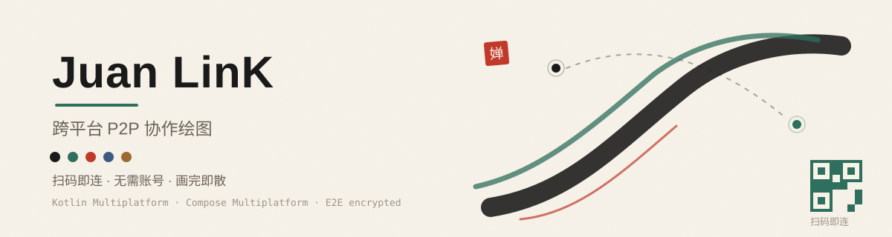

<p align="center">
  
</p>

# Juan LinK

跨平台 **点对点（P2P）协作绘图** 应用，基于 Kotlin Multiplatform + Compose Multiplatform 构建。

两台设备通过二维码配对，**无需账号、无需中心服务器**即可实时同步画笔与橡皮。同网段走局域网 TCP 直连；跨网络（对称 NAT / 蜂窝 CGNAT）经可配置的 **TURN 中继**兜底。所有同步帧经 X25519 + AES-256-GCM 端到端加密。

## 简介

Juan LinK 定位"打开即画"的极简协作画板：一端创建协作、生成二维码，另一端扫码即加入同一块画布。不设账号体系、不建云同步中心，连接通道全部建立在两端设备之间，你的画稿只在参与者之间传输。

## 能力一览

| 能力 | 说明 |
|---|---|
| 实时笔画同步 | Lamport 时钟全序合并，双端状态一致 |
| 全工具绘画 | 画笔 / 直线 / 矩形 / 圆形 / 三角形 / 箭头 / 文字 / 橡皮，双端同步 |
| 画布操控 | 缩放 / 平移 / 图层前移后移 / 撤销重做 |
| 二维码配对 | 扫码即连，或复制配对码加入 |
| 断线保护 | 自动重连 + 断线期间操作补同步，连接永不会自动被关闭（可手动断开） |
| 跨网兜底 | TURN 中继穿透对称 NAT；协作前引导配置 TURN（可跳过，仅局域网直连） |
| 端到端加密 | X25519 密钥交换 + AES-256-GCM 加密帧，密钥不经任何第三方 |
| 历史快照 | 手动 / 定时快照画布，侧栏回顾每一版 |

## 平台支持

| 平台 | 状态 |
|---|---|
| Windows / macOS / Linux（桌面） | 可用 |
| Android | 可用（含 CameraX 扫码加入） |
| iOS | 工程骨架占位，UI 层未实现 |

## 架构

```
:core        纯内核（协议 / 加密 / 同步引擎 / 传输），零 UI 依赖
:composeUi   共享 Compose UI（画布 / 工具栏 / 面板 / 连接）
:desktop     JVM 桌面壳（启动入口 + 平台 IO）
:androidApp  Android 客户端（CameraX 扫码 + 完整实现）
```

画布渲染接入 [DrawBox](https://github.com/ak1/design-oop)（Compose Multiplatform 矢量绘图引擎），统一桌面与安卓的绘画体验；历史缩略图复用其原生渲染器。

**传输栈**（`:core` `jvmAndAndroidMain`）：

```
上层:  OpSyncEngine（操作级同步） → SessionManager（握手 / 加密帧） → EncryptedFrame
中间:  ReliableDatagramSession（可靠有序 UDP：分片 + ACK + 重传） ← 中继数据面复用
底层:  TcpTransport（局域网直连） | TurnTransport（TURN 中继，UDP 数据报）
汇聚:  CompositeTransport（先 TCP，失败后 relay 兜底）
```

源集结构：`commonMain`（跨平台） + `jvmAndAndroidMain`（JVM / Android 共享中间层） + `jvmMain` / `androidMain`（平台实现）。

## 安全设计

- 每一次协作会话握手时经 X25519 协商出一次性会话密钥，密钥仅在两端内存中存在。
- 所有操作帧以 AES-256-GCM 加密传输，携带随机 nonce 与认证标签，防止窃听与篡改。
- 不依赖中心服务器鉴权：二维码即会话载体，扫码方持有配对信息即可安全地接入本会话。

## TURN 中继配置

默认仅携带**公共测试服务器**作 fallback（凭据公开、通常不可用）。跨网络连接需配置自己的 TURN 服务器（如自部署 coturn 或付费 TURN 服务），否则只能局域网直连。

首次启动未配置 TURN 时会弹出**配置引导**（可关闭，先本地画画）；未配置就点击"创建/加入协作"会弹出**强制引导**——只能保存至少一台服务器，或选择"跳过（仅局域网直连）"。

1. 桌面端：应用设置面板添加，或编辑 `~/.juanlink/turn.json`（JSON 数组，可按需多台）：

```json
[
  { "host": "your-turn.example.com", "port": 3478, "username": "user", "password": "pass" }
]
```

2. 安卓端：设置面板添加同一台服务器（两端须配置相同服务器）。
3. 跨网连接时，Initiator 会优先尝试自定义服务器，成功者连同中继地址写进二维码，Responder 据此连同一台。

## 构建

```bash
# 依赖：JDK 21，Android SDK（若构建安卓端）
./gradlew :core:jvmTest                 # 运行核心测试
./gradlew :desktop:createDistributable  # 桌面端可执行
./gradlew :androidApp:assembleDebug     # 安卓 Debug APK
```

Android 模块条件启用：存在 `local.properties`（含 `sdk.dir`）或 `ANDROID_HOME` 环境变量时才加入构建。

### Android release 签名

签名密码不入源码，release 构建需设置环境变量：

```bash
export JUANLINK_STORE_PASSWORD=...
export JUANLINK_KEY_PASSWORD=...
```

`androidApp/release.jks`（签名密钥库）已被 `.gitignore` 忽略，不随仓库分发。

## 文档

- [通信协议设计](docs/protocol.md) — P2P 帧格式、加密方案、NAT 穿越
- [数据结构](docs/data-structures.md) — Stroke / Layer / CanvasDocument 模型
- [API 设计](docs/api.md) — SessionManager / OpSyncEngine 等公开接口
- [压测方案](docs/stress-test.md) — 长稳压测场景与指标
- [用户手册](docs/user-guide.md) — 协作 / 绘画 / 图片操作说明

## License

[MIT](LICENSE) © 2026 Juan LinK contributors
